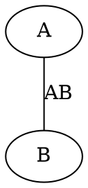

# **GrafoCSharp**

Grupo: Sabrina Ferreira, Willian Martins e Victoria Barbosa

Este projeto é uma aplicação em **C#** para manipulação e análise de grafos, suportando representações por matriz de adjacência e lista de adjacência. O programa também permite a execução de checagens e análises utilizando algoritmos clássicos de teoria dos grafos.

---

## **1. Requisitos**

Este projeto é baseado no **.NET Framework**. Certifique-se de atender aos seguintes requisitos antes de executar:

- **Sistema Operacional**: Windows, Linux ou macOS
- **SDK do .NET**: Versão 6.0 ou superior
- **Compilador C# (`dotnet`)**
- **Editor de Código**: Visual Studio, VS Code, Rider, ou qualquer outro editor compatível com C#

---

## **2. Como executar o projeto**

1. **Clone o repositório do projeto** ou copie os arquivos para sua máquina.

2. **Compile e execute o projeto**:

   - Via terminal:
     ```bash
     dotnet build
     dotnet run
     ```

3. O programa será executado no console, apresentando menus interativos para criar e manipular grafos.

---

## **3. Menu Principal**

O programa apresenta o seguinte menu principal para criar e manipular grafos:

| **Opção** | **Descrição**                                |
|-----------|---------------------------------------------|
| 1         | Adicionar vértice                           |
| 2         | Adicionar aresta                            |
| 3         | Exibir grafo                                |
| 4         | Remover aresta                              |
| 5         | Executar checagens                          |
| 0         | Sair do programa                            |

---

### 3.1. Adicionar Vértice

- Insira o rótulo do vértice (ex.: "A").
- Insira o peso do vértice (ou deixe vazio para usar o padrão `0`).

### 3.2. Adicionar Aresta

- Insira o ID ou o rótulo do vértice de origem.
- Insira o ID ou o rótulo do vértice de destino.
- Insira o peso da aresta (ou deixe vazio para usar o padrão `1`).
- Insira o rótulo da aresta (opcional).

### 3.3. Exibir Grafo

Apresenta o submenu:

| **Opção** | **Descrição**                                   |
|-----------|------------------------------------------------|
| 1         | Exibir grafo como matriz de adjacência         |
| 2         | Exibir grafo como lista de adjacência          |
| 3         | Gerar arquivo DOT para visualização (Graphviz) |
| 0         | Voltar ao menu principal                       |

### 3.4. Remover Aresta

- Insira o rótulo da aresta que deseja remover.

### 3.5. Executar Checagens

Apresenta o seguinte submenu:

| **Opção** | **Descrição**                                                     |
|-----------|-------------------------------------------------------------------|
| 1         | Verificar se o grafo é conexo                                    |
| 2         | Verificar se o grafo é acíclico                                  |
| 3         | Verificar se o grafo é regular                                   |
| 4         | Verificar se o grafo é Euleriano                                 |
| 5         | Verificar se o grafo é completo                                  |
| 6         | Verificar adjacência entre dois vértices                         |
| 7         | Obter vizinhança de um vértice                                   |
| 8         | Calcular menor distância de uma origem para todos (Dijkstra)     |
| 9         | Calcular menor distância de todos para todos (Floyd-Warshall)    |
| 10        | Calcular grau do vértice                                         |
| 11        | Realizar busca em profundidade                                   |
| 12        | Realizar busca em largura                                        |
| 0         | Voltar ao menu principal                                         |

---

## **4. Exemplos de Entrada e Saída**

### **Exemplo 1: Criar Vértices e Arestas**

#### Entrada:
```
- Adicionar vértice
  Rótulo: A
  Peso: 0

- Adicionar vértice
  Rótulo: B
  Peso: 0

- Adicionar aresta
  Origem: A
  Destino: B
  Peso: 1
  Rótulo: AB
```

#### Saída:
```
Vértice 'A' com peso 0 adicionado com sucesso!
Vértice 'B' com peso 0 adicionado com sucesso!
Aresta 'AB' de A para B com peso 1 adicionada com sucesso!
```

---

### **Exemplo 2: Exibir Lista de Adjacência**

#### Entrada:
```
- Exibir grafo
  Opção: Exibir por lista de adjacência
```

#### Saída:
```
Lista de Adjacência:
Vértice 0 (Rótulo: A, Peso: 0)
  -> Vértice 1 (Rótulo: B, Peso: 0) - Aresta (Rótulo: AB, Peso: 1)
Vértice 1 (Rótulo: B, Peso: 0)
  -> Vértice 0 (Rótulo: A, Peso: 0) - Aresta (Rótulo: AB, Peso: 1)
```

---

### **Exemplo 3: Executar Checagens**

#### Entrada:
```
- Executar checagens
  Opção: Verificar se o grafo é conexo
```

#### Saída:
```
O grafo é conexo.
```

---

## **5. Gerar Arquivo DOT**

Selecione a opção `3. Gerar arquivo DOT para visualização (Graphviz)` no menu de exibição. Um arquivo `grafo.dot` será gerado com a representação do grafo, que pode ser visualizado usando o **Graphviz**.

#### Exemplo de Arquivo DOT Gerado:



---

## **6. Finalizando**

- Para encerrar, basta selecionar `0. Sair` no menu principal.
